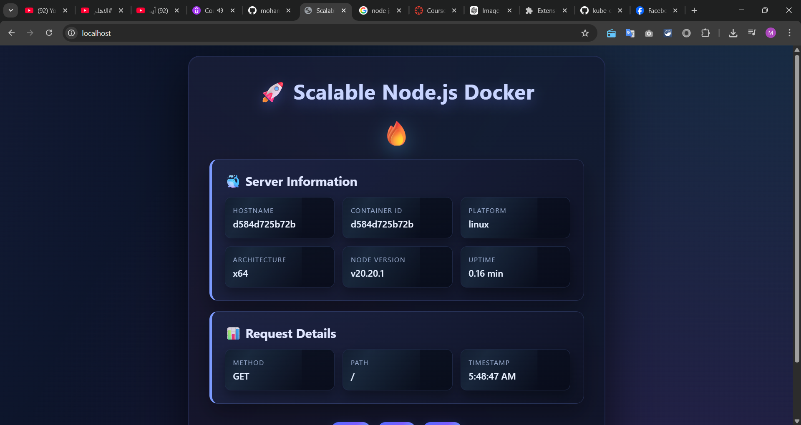

# Scaling Node.js with Nginx + Docker



## Overview

This repo demonstrates running a Node.js API behind an Nginx reverse proxy with multiple API replicas using Docker Compose.

## Quickstart

```bash
docker compose up --build
```

- Nginx proxy: `http://localhost/`

## Scale API replicas

The Compose file is set up to run multiple API replicas. To change the replica count, update `docker-compose.yml` (service `api` → `deploy.replicas`).

